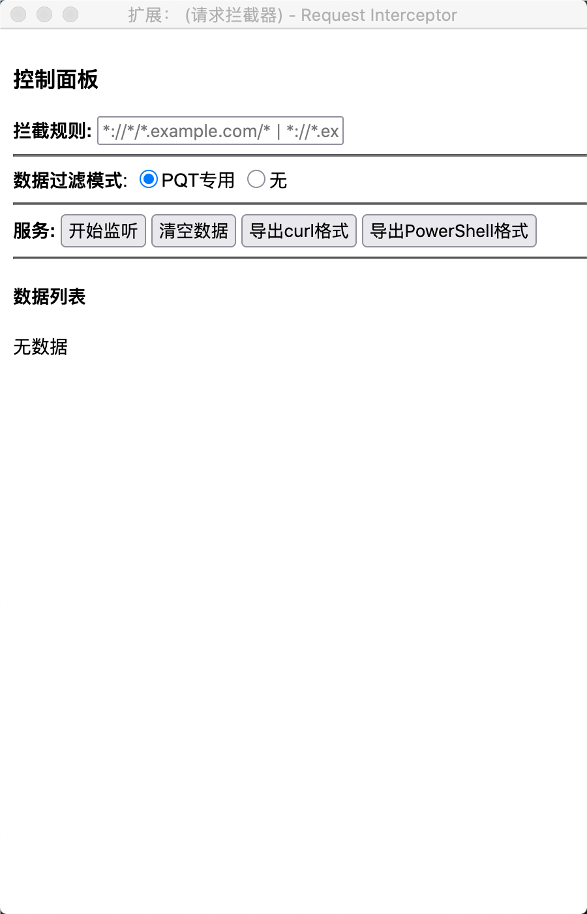
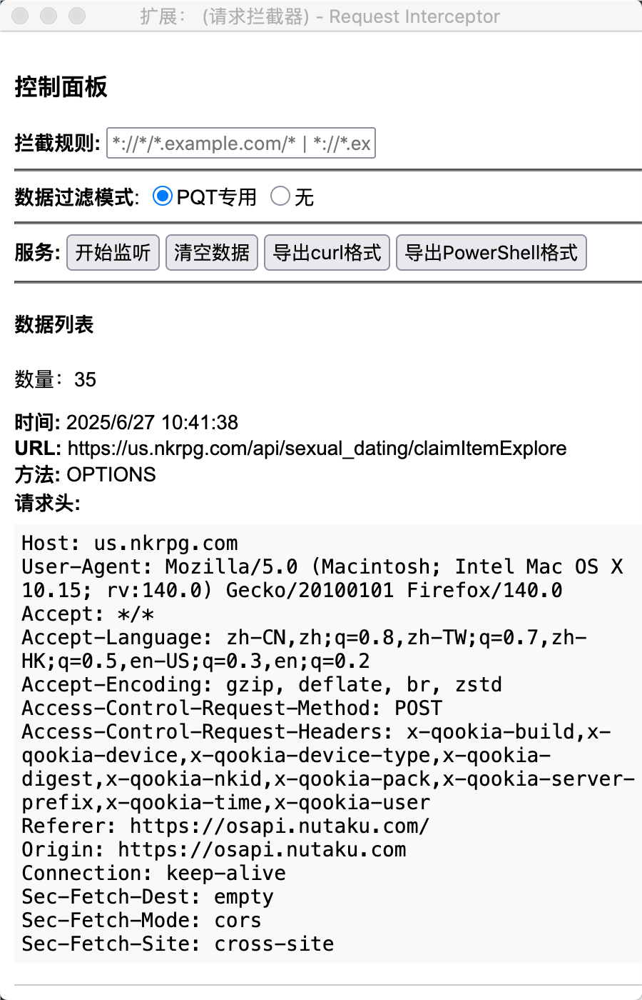

# Request Interceptor

一个简易的请求拦截器。

需要特别说明的是，本插件的目的只是用于导出PQT收菜脚本的接口抓包数据，以减少手工操作，且本插件只能在狐火浏览器上运行。

有其他需要拦截请求的场景时，请考虑Charles、Fiddler、浏览器开发者工具等这些拥有更加完善的、高级的功能的工具&模块。

（如果实在要用也不是不行，就是有点简陋，能接受这一前提的话，What can I say?）



图1 面板



图2 抓取数据

## 一、主要功能

### 1、监听请求

点击'开始监听'，进入监听状态后，即可拦截浏览器请求，默认拦截所有请求，可在规则输入框中指定拦截规则，如：*://*/*.example.com/*、*://*.example.com/api/*。

ps: 拦截请求数量上限为100，之后按照'先进队列'的条件删除数据，所以需要注意监听时机，尽量在较短的时间内完成目标事件，将目标请求包含在范围内，当然也可以指定规则，以更精准地拦截，如PQT可使用规则（截图2里可以看到）：https://us.nkrpg.com/api/*。

### 2、导出

将导出文件覆盖掉[收菜脚本](https://github.com/errr0l/pqt-claimer)目录里的同名文件即可。

#### 1）curl格式


图3 request.txt

#### 2）powershell格式


图4 request_ps.txt

### 3、数据过滤

按照一定的规则筛选请求数据，PQT收菜接口必选'PQT专用'。

## 二、使用示例

### 1、监听

<video width="320" height="240" controls>
  <source src="./static/7b5292222c8bda6230f34d47a7e55c82.mp4" type="video/mp4">
  Your browser does not support the video tag.
</video>

### 2、导出

<video width="320" height="240" controls>
  <source src="./static/7b5292222c8bda6230f34d47a7e55c82.mp4" type="video/mp4">
  Your browser does not support the video tag.
</video>

## 三、安装

有两种安装方式。

### 1、在火狐插件市场中下载安装

前往[狐火插件市场](https://addons.mozilla.org/zh-CN/firefox/)，搜索Request Interceptor -> 进入详情页 -> 添加到 Firefox -> 添加。

### 2、自行打包&安装

打包参照第四章节，不过这种方式只能临时安装，重启应用后将会被删除，因此该种方式只适用于临时调试。

1）在火狐浏览器搜索栏中打开：about:debugging#/runtime/this-firefox

2）点击"临时加载附加组件"

3）选择request-intercetpor.xpi

## 四、打包

打包为火狐插件。

```bash
# 进入src/目录
cd src/

# 将资源打包为.xpi文件
zip request-intercetpor.xpi *
```

目前的插件代码为纯静态，这意味着，如果以后收菜接口出现变动，就需要重新打包发布。咱其实也想搞动态，也就是通过web接口控制规则，让插件具备一定的健壮性&灵活性，但奈何没有一个相对稳定的服务器可用，因而只能采用当前方式。