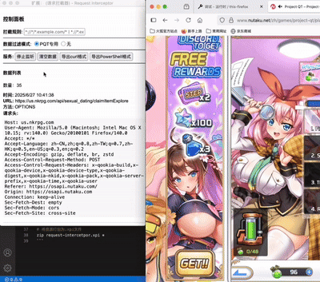

# Request Interceptor

一个简易的请求拦截器。

需要特别说明的是，本插件的目的只是用于导出PQT收菜脚本的接口抓包数据，以减少手工操作，<del>且本插件只能在狐火浏览器上运行</del>。

经测试发现，其实本插件也能在chrome等浏览器运行（版本为：128.0.6613.138），只是会有个警告⚠️。

有其他需要拦截请求的场景时，请考虑Charles、Fiddler、浏览器开发者工具等这些拥有更加完善的、高级的功能的工具&模块。

（如果实在要用也不是不行，就是有点简陋，能接受这一前提的话，What can I say?）


图1 面板


图2 抓取数据

## 一、主要功能

### 1、监听请求

点击'开始监听'，进入监听状态后，即可拦截浏览器请求，默认拦截所有请求，可在规则输入框中指定拦截规则，如：\*://\*/\*.example.com/\*、\*://\*.example.com/api/\*。

ps: 拦截请求数量上限为100，之后按照'先进队列'的条件删除数据，所以需要注意监听时机，尽量在较短的时间内完成目标事件，将目标请求包含在范围内，当然也可以指定规则，以更精准地拦截，如PQT可使用规则（截图2里可以看到）：https://us.nkrpg.com/api/\*。

### 2、导出

将导出文件覆盖掉[收菜脚本](https://github.com/errr0l/pqt-claimer)目录里的同名文件即可。

#### 1）curl格式


图3 request.txt

#### 2）powershell格式


图4 request_ps.txt

### 3、数据过滤

按照一定的规则筛选请求数据，PQT收菜接口必选'PQT专用'。

## 二、使用示例

### 1、拦截请求

请务必点击'开始监听'后，再进行操作，否则拦截不到数据。


### 2、导出数据

windows选powershell，unix系列选择curl，根据需要选择。



## 三、安装

有<del>两种</del>几种安装方式。

### 1、在火狐插件市场中下载安装

前往[狐火插件市场](https://addons.mozilla.org/zh-CN/firefox/)，搜索Request Interceptor -> 进入详情页 -> 添加到 Firefox -> 添加。

> https://addons.mozilla.org/zh-CN/firefox/addon/_request-interceptor/

### 2、自行打包&安装

打包参照第四章节，不过这种方式只能临时安装，重启应用后将会被删除，因此该种方式只适用于临时调试。

1）在火狐浏览器搜索栏中打开：about:debugging#/runtime/this-firefox

2）点击"临时加载附加组件"

3）选择request-intercetpor.xpi

### 3、chrome

尽管基于manifest_version_2的api开发的插件已经不能发布到拓展商店里，自行使用还是没问题的，而且chrome也不会像狐火那样麻烦（不会自主删除加载的插件）。

1）打开：chrome://extensions/

2）加载已解压的扩展程序

3）选中src/

## 四、打包

打包为火狐插件。

```bash
# 进入src/目录
cd src/

# 将资源打包为.xpi文件
zip request-intercetpor.xpi *
```

<del>目前的插件代码为纯静态，这意味着，如果以后收菜接口出现变动，就需要重新打包发布。咱其实也想搞动态，也就是通过web接口控制规则，让插件具备一定的健壮性&灵活性，但奈何没有一个相对稳定的服务器可用，因而只能采用当前方式。</del>

竟然忘了github本身就是个稳定的服务器。。那没事了，现在可以在插件界面，点击"同步配置"来拉取存放在本仓库的配置文件。

## 更新日志

### 202512

1、新增了自定义导出规则

额外规则 -> 自定义 -> 在输入框中填写接口地址，用法跟之前类似，使用半角分号将接口分隔。

### 202511

1、新增拦截模式选项

有两个选项："仅拦截数据"和"取消请求"。

仅拦截数据，表示正常请求服务器；

取消请求，表示取消请求服务器；

但请注意，无论选中哪个，都只会在点击"开始监听"时生效，"监听"过程中无法更改，想要变更模式，只能点击"停止监听"后，再重新监听。

2、优化了插件界面

现已单独为数据列表填加了滚动条（此前是滚动整个界面）。


3、新增拦截指定请求方法的特性

可指定拦截需要的请求方法，进一步筛选请求。


### 202508

1、新增设置导出文件名的功能

点击按钮后，在弹窗处设置即可，后缀为.txt。

2、新增复制单个抓包数据的功能

操作 -> 复制为curl、复制为PowerShell

3、删除使用&&分割命令

4、新增了动态配置的功能

可从github仓库中拉取配置文件

5、新增选项记录功能

记录选中的“拦截规则”或“数据过滤模式”，作为冷启动的数据